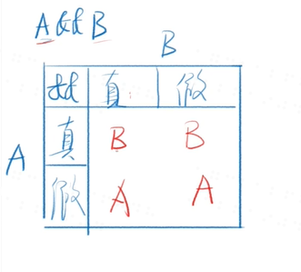
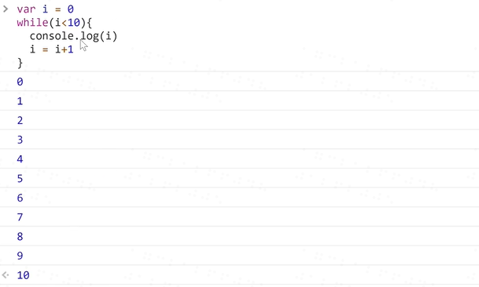
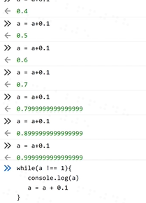
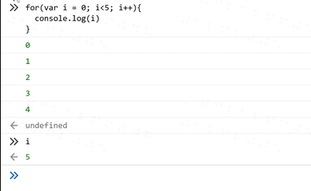
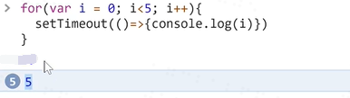
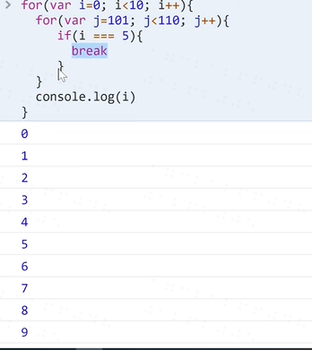
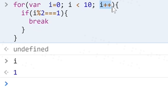
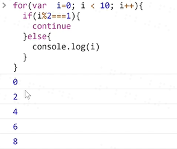
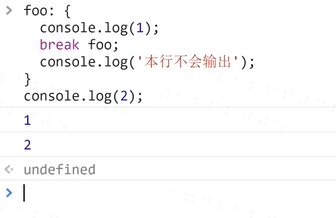

# JS 的基本语法
## 表达式和语句
### 表达式
1. 1+2 表达式的值为3
2. add (2,3)表达式的值为函数的返回值
3. console.log表达式的值为函数的本身
4. console.log(3)表达式的值为undefined，打印出的东西为3.
### 语句
var a = 1是一个语句，声明a为1
### 区别
* 表达式一般都有值，语句可能有也可能没有。
* 语句一般会改变环境(声明或赋值)
### 大小写敏感
**大部分空格没有实际意义**
**加回车大部分也不影响**
***只有return后面不能加回车***
## 标识符
1. 第一个字符可以是Unicode字母或$或_或中文
2. 后面的字符，除了上面所说还可以有数字。
## 区块block
```
{
let a =1
let b =1
}
```
常与if/for/while合用
## if else 语句
### 语法
1. if(表达式){语句1}else{语句2}
2. {}在语句中只有一句是可以省略，建议不要省略

### 变态情况
1. 表达式里可以非常变态，如a=1
2. 语句1里可以非常变态，如嵌套的if else
3. 语句2里也可以非常变态，如嵌套的if else
4. 缩进也非常变态如
```
a = 1
if(a === 2)
    console.log('a')
    console.log('a等于2')
```
**第二个console前面是有空格的，不属于if的语法中**
### 推荐写法
```
if ( 表达式) {
    语句
} else if (表达式 ) {
    语句
} else {
    语句
}
```
### &&短路逻辑和||短路逻辑
1. A&&B&&C&&D取第一个假值或者D(不会取false或true)
2. A||B||C||D取第一个真值或D(不回取false或true)

### while语法
1. while(表达式){语句}
2. 判断表达式的真假
3. 当为真，执行语句，执行完再判断真假
4. 当表达式为假，执行后面的语句。


这是死循环，因为浮点数


## for循环
### 语法糖
1. for是while循环的方便写法
2. for(语句1;表达式2;语句3;){
   循环体}
3. 先执行语句1
4. 然后判断表达式2
5. 如果为真，执行循环体，然后执行语句3
6. 如果为假，直接退出循环，然后执行后面语句





## break和continue语法
退出当前的循环，只会退出离他最近的for


## label语法
```
foo: {            // foo是标识符
console.log(1);
break foo;
console.log(' ');
}
console.log(2);
```
```
{
foo: 1
}是标签，值为1
```



